# AEC Open Shift | Lab Guide

<!-- TOC -->

1. [Workshop Architecture and Objective](#workshop-architecture-and-objective)
2. [Lab 1: Introduction to Azure Portal](#lab-1-introduction-to-azure-portal)
3. [Lab 2: Deploying Open Shift cluster using ARM templates](#lab-2-deploying-open-shift-cluster-using-arm-templates)
4. [Lab 3: Deploying workload on Openshift](#Lab-3-deploying-workload-on-openshift)
5. [Lab 4: Integration of ACR with OpenShift](#Lab-4-integration-of-acr-with-openShift)

<!-- /TOC -->

## Workshop Architecture and Objective
 As part of Hand on Lab, you will get following details via email. Make a note of these details as these shall be leveraged throughout the lab exercise
- Azure Access: Azure Username and Password (Default Password, Change at first login)

### Labs Objective
During this lab, you will deploy Open Shift cluster on Azure and integrate Azure AD Authentication and Azure Container Registry into Open Shift. Detailed steps to achieve this is as follows.
- Get Familiar with Azure Portal and Ansible Tower UI
-	Create an Azure AD Application for Authentication
-	Create a key vault to store SSH Key
-	Deploy Open Shift using ARM Template
-	Configure Azure AD Authentication
-	Deploy 2 Tier App on Open Shift
-	Integration of Azure Container Registry with Open Shift

### Workshop Architecture after deploying ARM Template
Following illustrates the architecture in your Azure deployment after completion of exercise’s part of workshop.
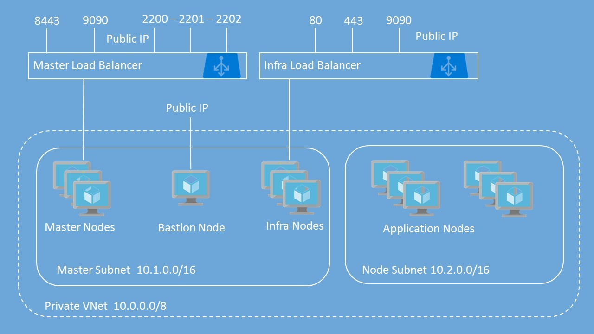
## Lab 1: Introduction to Azure Portal
### Lab Overview
This lab will take you through Azure login and portal experience.

### Prerequisites
-	Windows or a Mac machine with HTML5 supported browser such as Microsoft Edge, Internet Explorer, Chrome or Firefox
-	You should have registered in the training portal https://azuretraining.spektrasystems.com and received the confirmation message with the credentials to login to the [Azure portal](http://portal.azure.com).
-	Red Hat Customer Portal login credentials so that the Azure instances can be registered with Red Hat Subscription Manager properly, and you must have enough OpenShift Container Platform entitlements to cover the chosen configuration.
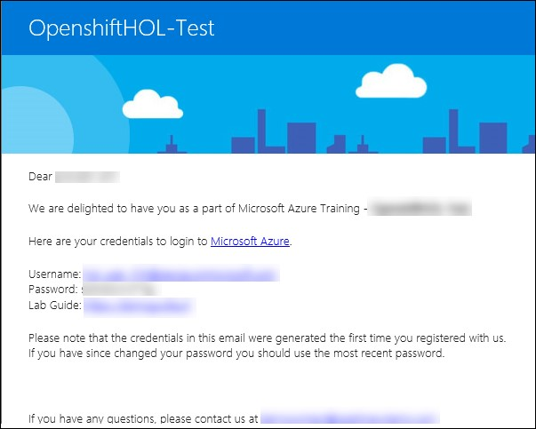

### Time Estimate

10 minutes

### Exercise 1: Log into your Azure Portal

In this exercise, you will log into the Azure Portal using your Azure credentials.
1.	**Launch** a browser and **Navigate** to https://portal.azure.com. Provide the credentials that you received via email. Click on **Sign In**.
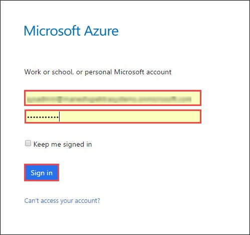

```
Note : At the first login, you may have to change the password, if asked for.
```

2.	**Enter** a new **password**. Then select **Update password and sign in**.
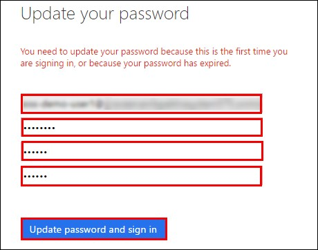

3.	Now, you will be directed to the Azure Dashboard
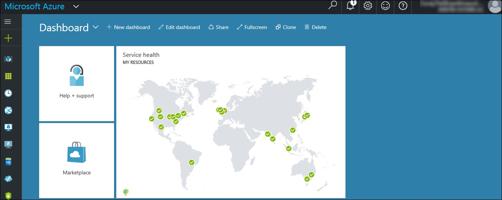

### Exercise 2: Verify access to the Subscription
In this exercise, you will verify the type of role you are assigned in this Subscription.

1.	**Launch** a browser and **Navigate** to https://portal.azure.com. **Login** with the Microsoft Azure credentials you received via email.


2. **Click** on **Microsoft Azure**  at the top left corner of the screen, to view the Dashboard.
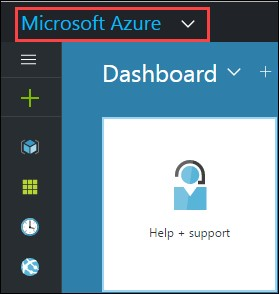

3.	To toggle **show/hide** the Portal menu options with icon, **Click** on the **Show Menu** button. 
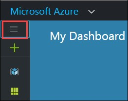

4.	**Click** on the **Resource groups** button in the **Menu navigation** bar to view the **Resource groups** blade.
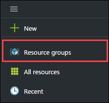

5.	You will see a Resource Group which you have access to, **click** on it.

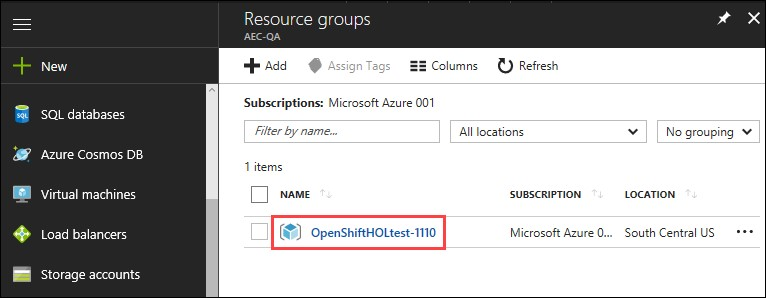

```
Note:
The Resource Group shown here is for demo purpose only. Actual name of the Resouce Group that you see may differ.
```

6.	From the Resource Group blade that come up, **Select** the Access Control ( IAM ) which is on the left side of the blade.
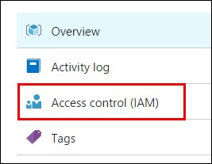

7.	In the new blade that come up, you can see the **role** that is assigned to you.
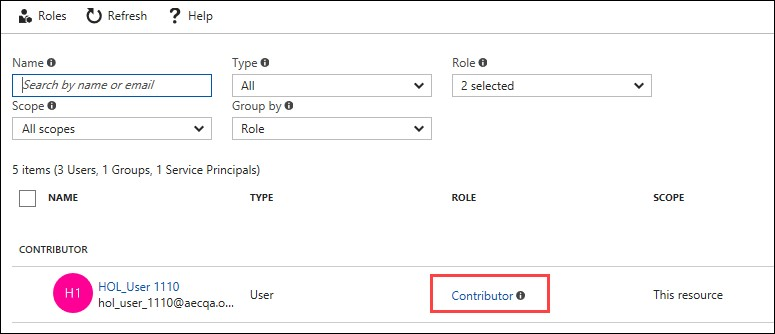

## Lab 2: Deploying Open Shift cluster using ARM templates
### Lab Overview
In this lab, you will learn how to deploy the Open Shift Cluster on Azure using ARM templates.
### Prerequisites
•	Lab 1 must be completed

### Time Estimate
120 minutes

### Exercise 1: Create an Azure AD Application
In this exercise, you will create an Azure AD App and retrieve the Client ID and Client secret values.
1.	**Launch** a browser and **Navigate** to https://portal.azure.com. **Login** with the Microsoft Azure credentials you received via email.


2.	**Click** on the **Azure Active Directory** button in the **Menu navigation** bar to view the **Azure Active Directory** blade.
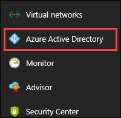

3.	You will be directed to the Azure Active Directory blade, **click** on **App registrations**.


4.	In the next blade, **click** on **New Application Registration** on top of the blade.
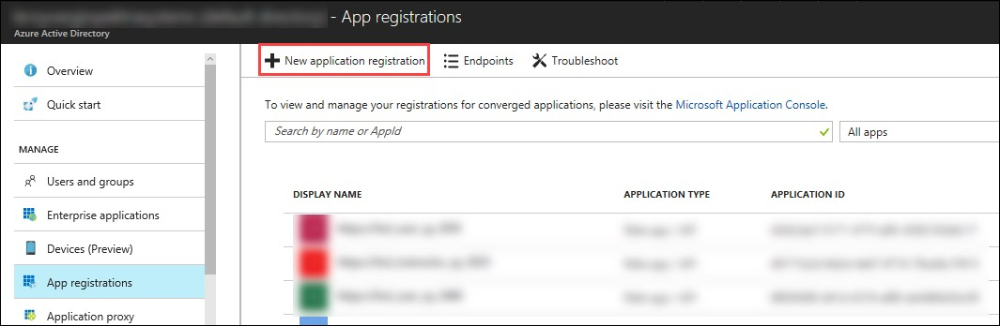

5.	In the **Create** blade, **configure** as follows:

-	Name: **(Provide a unique value)**
-	Application type: **Web app/API**
-	Sign-on URL: https://contoso.com

```
Note: We will change this value later during the lab.
```

And then **click** on **Create**.

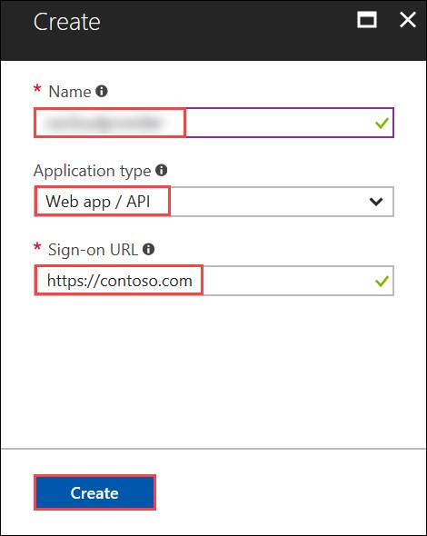

6.	You will be redirected to the **App registrations** blade. You can check the app has been created by typing the App Name in the search field.
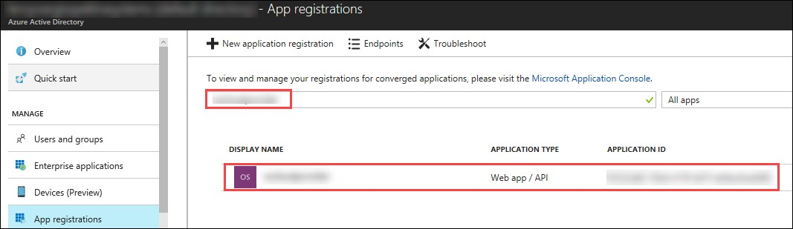

If the app has been created, you can see it in the results as shown above.

7.	Click on the app you created and you will be directed to the App blade.

8.	Copy the Application Id and save it in a notepad or any text editor for later use.
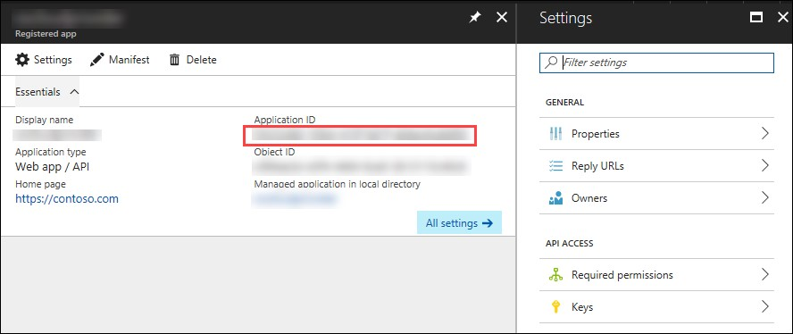

9.	Now, **Click** on **Keys** in the settings blade.


10.	In the **Keys** blade, **configure** as follows:

- Description: **key1**
- Expires: **Never expires**

And **Click** on **Save.**

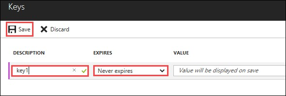

11.	After you click on save, the key value will be displayed which is the Client Secret.
Copy the value into the text editor where you saved the value of Application Id for later use.
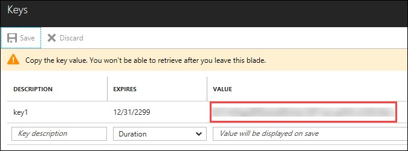

### Exercise 2: Create a Keyvault 
In this exercise, you will configure Azure Bash Cloud Shell and create a Key vault in the existing resource group and store the SSH key inside the vault. 
1.	**Launch** a browser and **Navigate** to https://portal.azure.com. **Login** with the Microsoft Azure credentials you received via email.
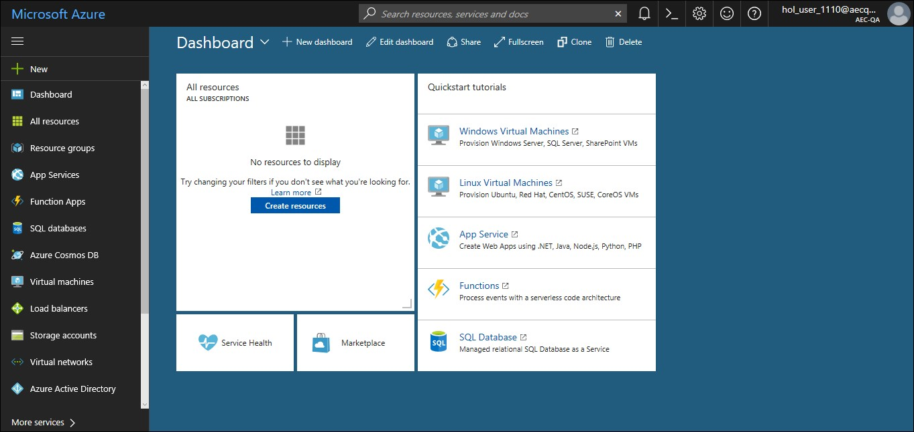

2.	**Click** on **Cloud Shell**  at the top right corner of the screen, to open the cloud shell.


3.	Then **Click** on **Bash ( Linux )**, and in the next page, **click** on **Show advanced settings**
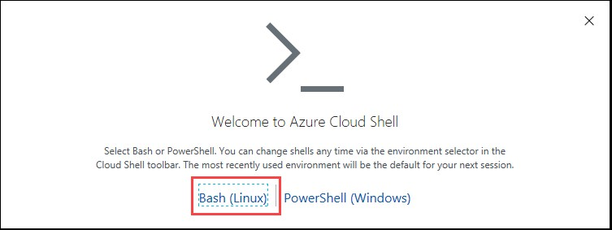
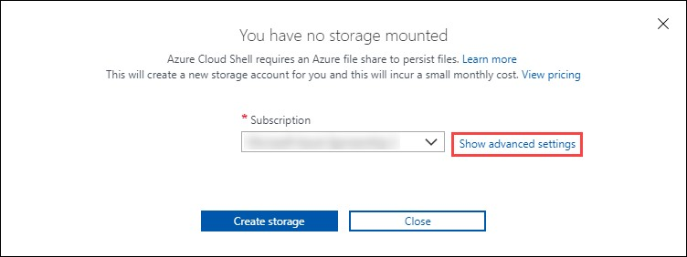

4.	In the new blade, select the existing resource group, provide unique names under Create new(Storage account and File share) and **click** on **Create Storage**.
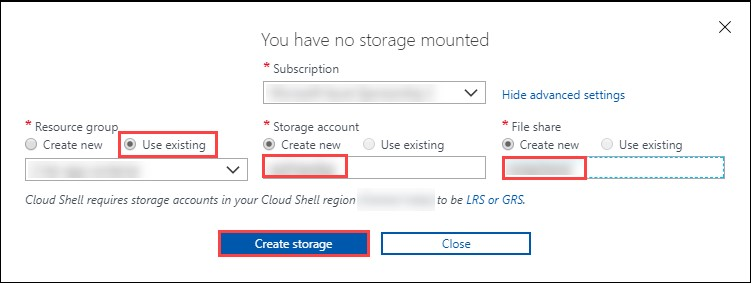

5.	In a few minutes, the bash shell will come up.
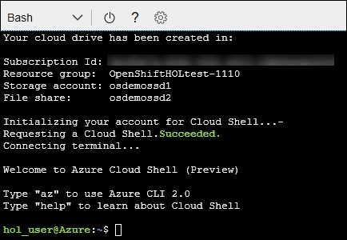

6.	Now execute the following command in the cloud shell to create a key vault in the existing resource group.
```
az keyvault create -n <uniquename> -g <ResourceGroup> -l <LocationOfResourceGroup> 
--enabled-for-template-deployment true
```
```
Note:
Provide the existing Resource Group name, it’s location and a unique name for key vault in the above command when executing
```
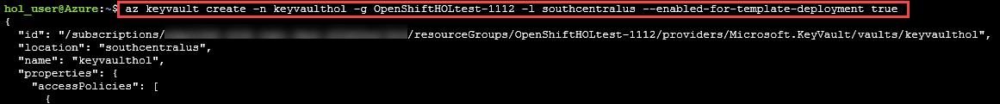

7.	Now execute the following command in the cloud shell to generate ssh key.
```
ssh-keygen
```
```
Note: Keep on clicking enter button until the key has been created.
```


8.	Now execute the following command in the cloud shell to display the public ssh key. Copy the key into a text editor for later use.
```
cat .ssh/id_rsa.pub
```
```
Note: 
The copied SSH Key should be made into a single line. You will need this key for later use.
```


9.	Now execute the following command to store the generated key in the key vault.
```
az keyvault secret set --vault-name <keyvaultname> -n osdemovaultsecret --file ~/.ssh/id_rsa
```
```
Note:
Substitute for key vault name in the above command with the name of the keyvault created earlier when executing.
```
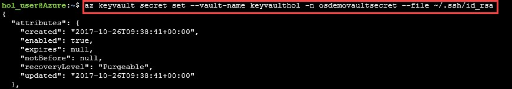

## Exercise 3: Deploy Openshift Cluster using ARM Template  
In this exercise, you will deploy the Openshift cluster on Azure using ARM Template . 
1.	**Launch** a browser and **Navigate** to https://github.com/SpektraSystems/openshift-container-platform

2.	Now **click** on **Deploy to Azure** button and you will be redirected to the azure portal. If prompted **login** with the Microsoft Azure credentials you received via email.
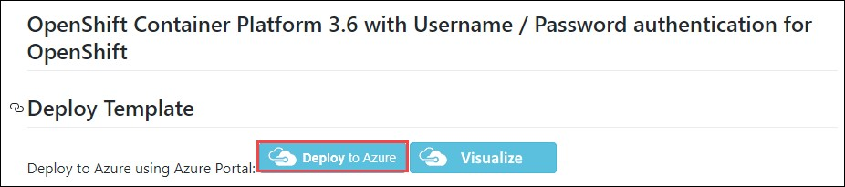

3.	Now you will be directed to the Custom Deployment blade.
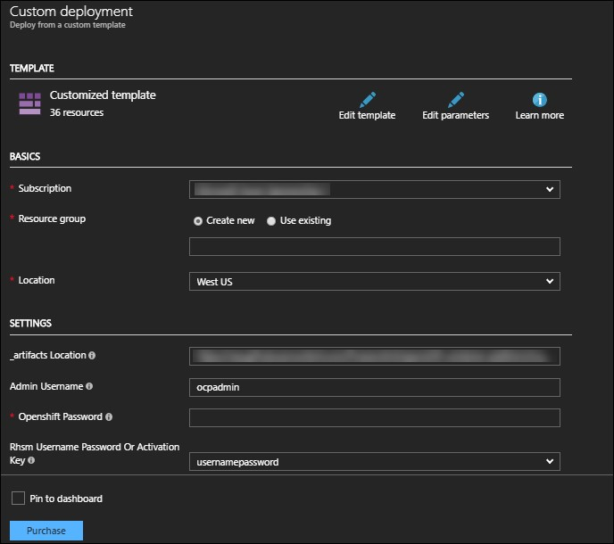

4.	In the **Custom Deployment** blade, **configure** the settings as follows:
-	Resource Group : Choose Use **existing** and scroll down to see the Resource Group which is already there)
-	Openshift Password  :  **Provide a unique password**
-	Ssh Public Key :  **Provide the copied SSH key**
-	Rhsm Username or Org Id: **Provide the username of Redhat credentials**
-	Rhsm Password or Org Id: **Provide the password of Redhat credentials**
-	Rhsm Pool Id: **Provide the pool Id of Redhat OpenShift Subscription**
-	Key Vault Name : **Provide the Key Vault name you provided**
-	Key Vault Secret : **osdemovaultsecret**
-	Aad Auth App Name : **Provide the name of the AD App you created** 
-	Aad Auth App Id : **Provide the Client ID of the AD App you created** 
-	Aad Auth Client Secret : **Provide the secret key of the AD App**
**And** accept the terms of conditions.
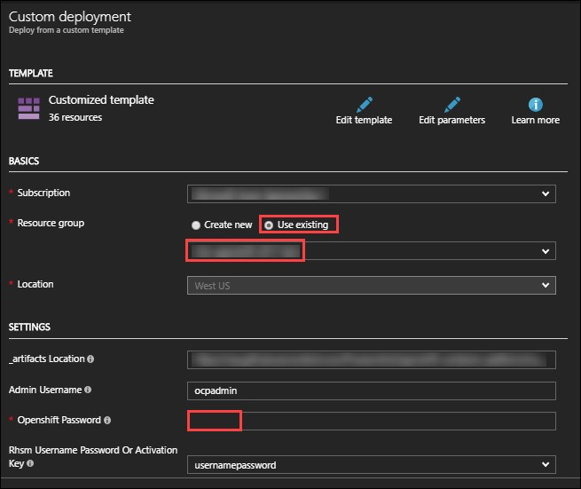
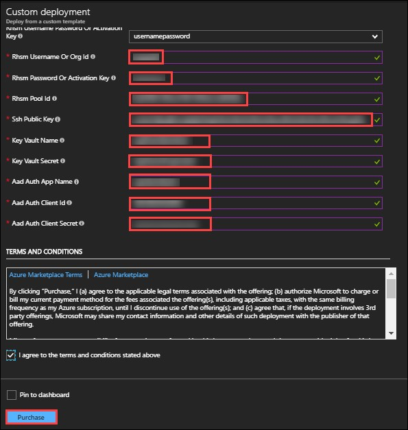

5.	And then **click** on **Purchase**.

6.	Once the deployment starts, you can see the progress in the notification bar at the top of the Azure portal.
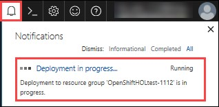

7.	Once the deployment is complete, you can see it in the notifications tab as Deployment succeeded. Now, **click** on **Go to resource group** from the notifications tab.
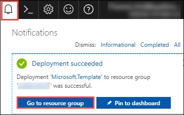

8.	In the resource group blade that come up, you can see the deployments as Succeeded, click on that.
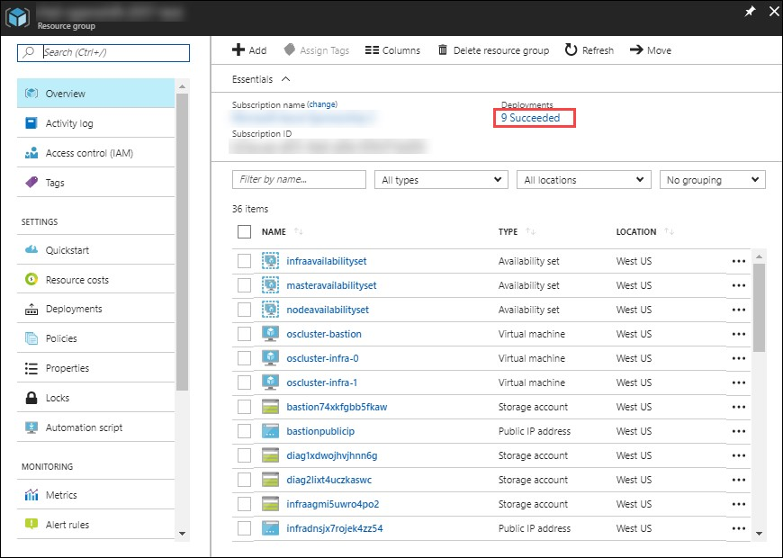

9.	Select **Microsoft Template** from the new blade that come up.
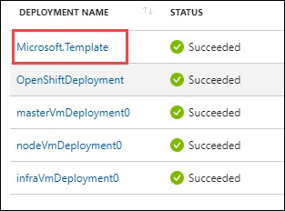

10.	From the new blade that come up, you can see the outputs of the deployment.


11.	Copy the Openshift Console URL, Bastion DNS FQDN and OpenShift Master SSH by clicking on Copy to a text editor

12.	To verify that the deployment is working, **Open** a new tab in the browser and paste the copied URL.
```
Note: Skip the certificate warning
```

13.	Now you will be directed to the Openshift Console Login page.
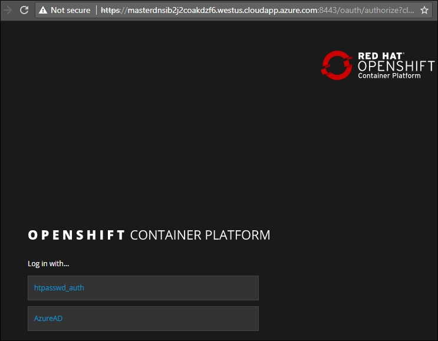

```
Note: If the above page comes up, then the deployment is working.
```

## Exercise 4: Configure Azure AD Authentication
In this exercise, you will configure the AD App you created for Authentication into the Open Shift console.
1.	**Launch** a browser and **Navigate** to https://portal.azure.com. **Login** with the Microsoft Azure credentials you received via email.


2.	**Click** on the **Azure Active Directory** button in the **Menu navigation** bar to view the **Azure Active Directory** blade.


3.	You will be directed to the Azure Active Directory blade, **click** on **App registrations**.
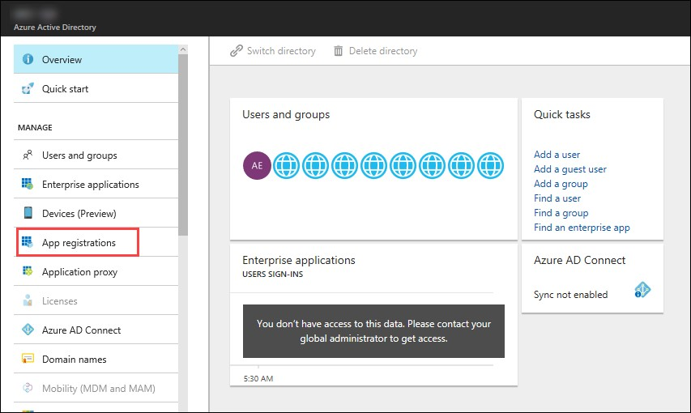

4.	You will be redirected to the **App registrations** blade. You can search the App by typing the name of the App you created earlier, in the search field.


5.	Click on the app you created and you will be directed to the App blade.
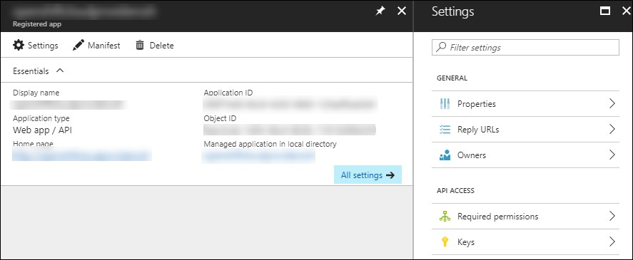

6.	Now Click on Properties under Settings blade.
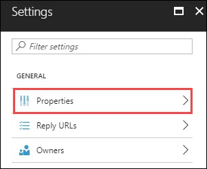

7.	In the **Properties** blade, **edit** as follows:
-	App ID URI: (Provide the Open Shift Console URI)
-	Home Page URL type: (Provide the Open Shift Console URI)
And then **click** on **Save**.
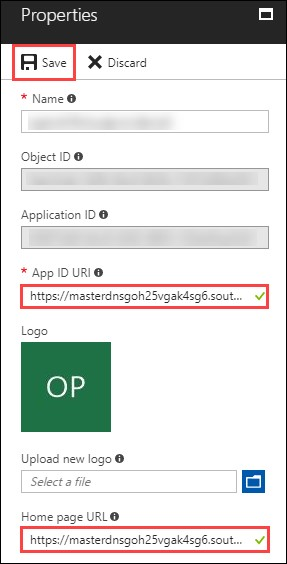

8.	Once you save the properties, close the properties blade.
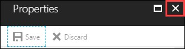

9.	Then you will be redirected to the Settings Blade of AD App. Click on the Reply URLs
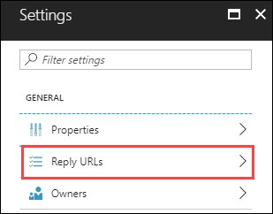

10.	Now modify the openshift console url by removing the ‘console’ from the end and appending ‘oauth2callback/AzureAD’ to the url and provide it in the Reply URL blade that come up and then Click on Save. 
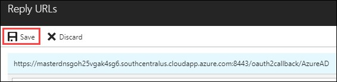

11.	Now go back to the setting blade of the App and Click on Required permissions.
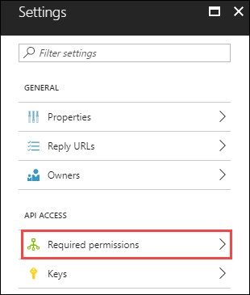

12.	Click on Grant Permissions in the blade that come up and then **Click** on **Yes**
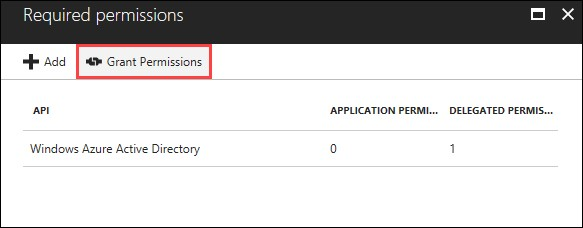


13.	Now go back to the **Active Directory** blade by clicking on Azure Active Directory button in the **Menu navigation** bar.


14.	Click on Enterprise Applications from the menu on the left side.
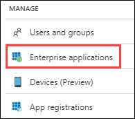

15.	In the new blade that come up, click on **All applications**


16.	In the new blade that come up, edit the filter as follows: 
-	Show: Select All Applications
-	Application status: Any
-	Application visibility: Any
And then **click** on **Apply**.
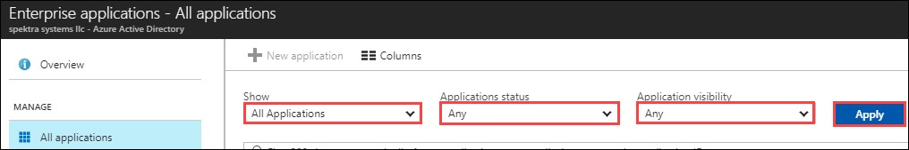

17.	You can search the App by typing the name of the App you created earlier, in the search field.
Select the App from the results.


18.	You will be redirected to the App Blade. Click on Properties under Manage section on the left side of the properties blade.
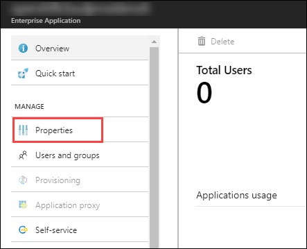

19.	In the new blade that come up, select User Assignment Required and Click on Save.
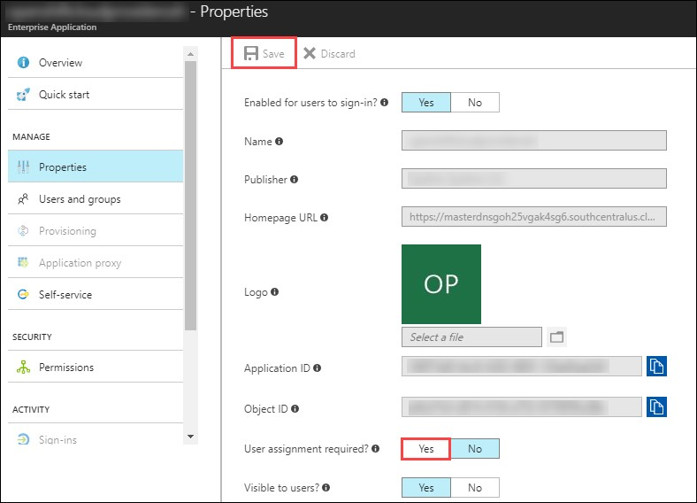

20.	Now, click on **Users and groups** under Manage section on the left side of the App Blade.
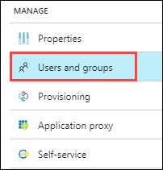

21.	In the blade that come up, click on **+Add user** to assign a user to the app.
```
Note: If user is already added then skip next three steps.
``` 
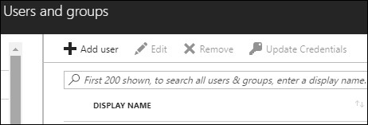

22.	In the Add Assignment blade that come up, click on Users and then select the id with which you logged in to Azure portal and click on **Select**.
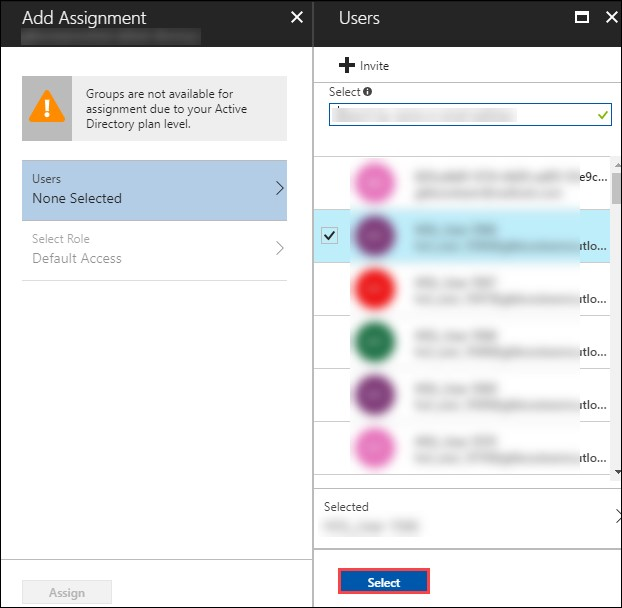

23.	Now you will be redirected to the Add Assignment blade. Click on Assign to assign the user to the app.
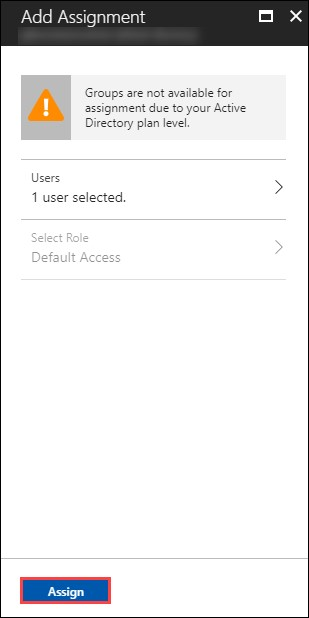

24.	Now to verify that the user is able to authenticate to Openshift console via Azure AD, **Open** a new tab in the browser and paste the Openshift Console URL which you copied earlier.
```
Note: Skip the certificate warning
```


25.	Now click on AzureAD, you will be redirected to the Login Page. Provide the Azure credentials you received via email over there and click on Sign in.
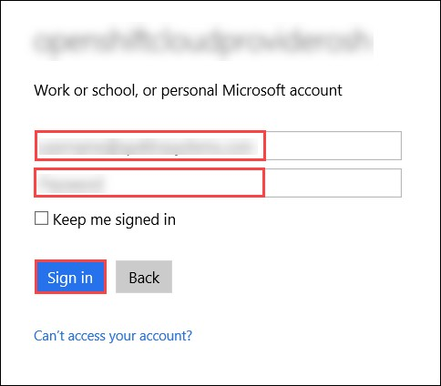

26.	Once the login is successful, you will be redirected to the Openshift console.
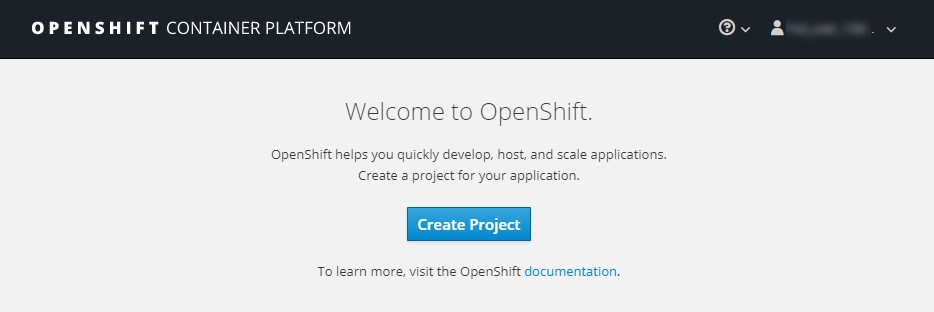
 
 
## Lab 3: Deploying workload on Openshift
### Lab overview
In this lab, we will deploy a workload on OpenShift.

### Prerequisites
- Lab 1 must be completed

### Time Estimate
45 minutes

### Exercise 1: Deploy a 2 Tier Node JS Application on Open Shift
In this exercise, you will deploy a 2 tier Node.js app on Open Shift and configure it to use the DB on Azure.

1.	**Launch** a browser and **Navigate** to https://portal.azure.com. **Login** with the Microsoft Azure credentials you received via email.
 
2.	Click on +New on the left side of the Dashboard.
 
3.	In the **New** blade that come up, Select **Databases**. 
 
4.	In the **Databases** blade appears. Select **Azure Cosmos DB**
 
5.	In the create blade that come up, configure the settings as follows:
-	ID  :  **uniquename** (This name should be unique across Azure.)
-	API :  **MongoDB**
-	Subscription : Select the **existing** subscription
-	Resource Group : Choose Use existing and scroll down to see the Resource Group which is already there and select that)
-	Location: **South Central US**
 
And then Click on Create.

6.	You can see the status of the deployment from the notifications tab on top of the page.
 
7.	Once the deployment is successful, click on Go to resource from the notifications tab.
 
8.	Now you will be directed to the deployed database.
 
9.	Now, click on Connection String under settings menu on the left side of the blade.
 
10.	Now from the new blade that come up, copy the connection string for later use.
 
11.	Now, open a new tab in a broswer and navigate to the Openshift console url. Login into the Openshift console using the credentials you received via email by Selecting AzureAD as authentication type.
 

### Exercise 2: Installing OpenShift CLI
#### COMMAND LINE INTERFACE
OpenShift ships with a feature rich web console as well as command line tools to provide users with a nice interface to work with applications deployed to the platform. The OpenShift tools are a single executable written in the Go programming language and is available for the following operating systems: 
-	Microsoft Windows 
-	Apple OS X
-	Linux

#### Installing the CLI
The easiest way to download the CLI is by accessing the **Command line tools** page on the web console.
1.	Click on down arrow key as shown in below screenshot and click on **Command Line Tools**.
 
2.	On **Command Line Tools** page, click on **Latest Release**.
 
3.	Now, you need to login in to your red hat account(one which has license for Openshift)
 
4.	scroll down and click on download.

5.	Once the file has been downloaded, you will need to extract the contents of the same at below directories.</br>
Windows: 	**C:\OpenShift**</br>
OS X: 		**~/OpenShift**</br>
Linux: 		**~/OpenShift**</br>

**Windows** : To extract a zip archive on windows, you will need a zip utility installed on your system. With newer versions of windows (greater than XP), this is provided by the operating system. Just right click on the downloaded file using file explorer and select to extract the contents to

**OS X** : Open a terminal window and change to the directory where you downloaded the file. Once you are in the directory, enter in the following command: 
```
$ tar zxvf <File_Name>
```

**Linux** : Open a terminal window and change to the directory where you downloaded the file. Once you are in the directory, enter in the following command: 
```
$ tar zxvf <File_Name>
```

6.	Now you will need to add **oc** to your system’s environment variable path:</br>
**Windows** : Open Command prompt and run below command:
```
set PATH=%PATH%;C:\OpenShift
```

**OS X**: Open shell and run below command.
```
$ export PATH=$PATH:~/OpenShift 
```

**Linux** : Open shell and run below command.
```
$ export PATH=$PATH:~/OpenShift
```

7.	Now run below command on shell/command prompt to check the version of OpenShift client an to verify that it is successfully configured.
 
### Exercise 3: Deployment in OpenShift using CLI
In this exercise, you will learn how to create a new project on OpenShift and how to create an application from an existing docker image.
1.	Launch the command line and run below command and enter username and password as you have received in your lab mail.
```
oc login <URL of Openshift:8443>
```

2.	Create an OpenShift project by running below command. 
3.	Now you can see the project is created successfully.
```
oc get projects
```

4.	You can also check the status of the project by running the following command.
```
oc status
``` 

5.	Create new application using below command 
```
oc new-app redhatworkshops/welcome-php --name=welcome
``` 

6.	The above command uses the docker image to deploy a docker container in a pod. you will notice that a deployed pod runs and it starts an application pod as shown below.
```
oc get pods
``` 

7.	To view the list of services in the project, run the following command below
```
oc get services
``` 

8.	Now add a route to the service with the following command.
```
oc expose service welcome --name=welcome 
``` 

9.	Now go to your openshift platform and click on applications>hostname, you can access the application from the browser and see the result.
 
10.	To view all the components that were created in your project, run he command is given below.
```
oc get all
``` 

11.	Now you can delete all these components by running one command.
```
oc get all --all
```

### Exercise 4: Create an App using Docker build
In this exercise, you will learn how to create an application from a Dockerfile. OpenShift takes Dockerfile as an input and generates your application docker image for you.

1.	You can create a new project or use existing project that created in exercise 3. To make sure you have the existing project run the following command.
 
2.	Now, we are using the Dockerfile as the basis to create a docker image for application. Run the command is given below.
```
oc new-app https://github.com/RedHatWorkshops/time --context-dir=rhel
```

3.	Now, look at the buildconfig by running the command shown below.
 ```
 oc get bc time -o json
 ```
 
4.	To view the list of build, run command is given below.
```
oc get builds
``` 

5.	Run the command as shown below to look at the build logs.
```
oc  logs build/time-1 
```

6.	Now we will deployment configuration by running the following command.
```
oc get dc -o json
{
    "apiVersion": "v1",
    "items": [
        {
            "apiVersion": "v1",
            "kind": "DeploymentConfig",
            "metadata": {
                "annotations": {
                    "openshift.io/generated-by": "OpenShiftNewApp"
                },
…………
…………
…………
                "creationTimestamp": "2017-11-10T11:22:28Z",
                "generation": 3,
                "labels": {
    "metadata": {},
    "resourceVersion": "",
    "selfLink": ""
}
```

7.	Now, you can get the list of pods, Run the following command is given below.
```
oc get pods
```

8.	Now, add a route to expose that service, Run the following command is given below.
```
oc get services
``` 

9.	Now, we expose the service as a route.
```
oc expose service time
```

10.	Now, we check the route is exposed.
```
oc get routes
```

11.	For run the application, copy the host/port and paste in browser and you can see the result.
 


